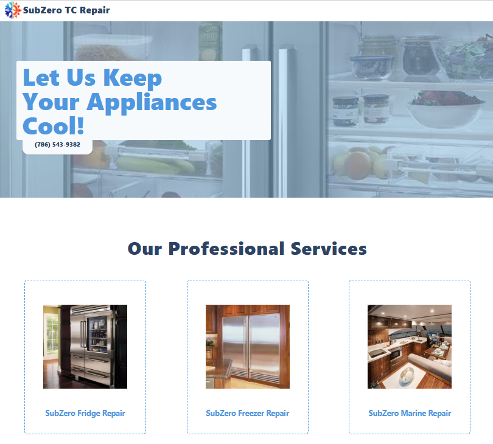

# SubZero TC Repair Website

A promotional website for SubZero TC Repair, a refrigeration repair company specializing in SubZero appliances.



## Tech Stack

- **Frontend**: Next.js 12 (React framework)
- **Styling**: Tailwind CSS
- **Deployment**: Vercel (recommended for Next.js projects)

## Project Purpose

This website serves as a digital presence for SubZero TC Repair, showcasing their services, expertise, and contact information. It aims to attract potential customers and provide essential information about the company's offerings.

## Setup

1. Clone the repository:

   ```bash
   git clone [your-repo-url]
   cd subzero-tc-repair
   ```

2. Install dependencies:

   ```bash
   npm install
   ```

3. Run the development server:

   ```bash
   npm run dev
   ```

4. Open [http://localhost:3000](http://localhost:3000) in your browser to view the site.

## Deployment

This project is optimized for deployment on Vercel:

1. Push your code to a GitHub repository.
2. Connect your GitHub account to Vercel.
3. Import the project from your GitHub repository.
4. Vercel will automatically detect it as a Next.js project and set up the build configuration.
5. Click "Deploy" and your site will be live in minutes.

## Project Structure

- `app/`: Contains the main application code and pages
- `public/`: Static assets like images and fonts
- `components/`: Reusable React components
- `styles/`: Global styles and CSS modules

## Contributing

Contributions are welcome. Please open an issue or submit a pull request for any improvements.
